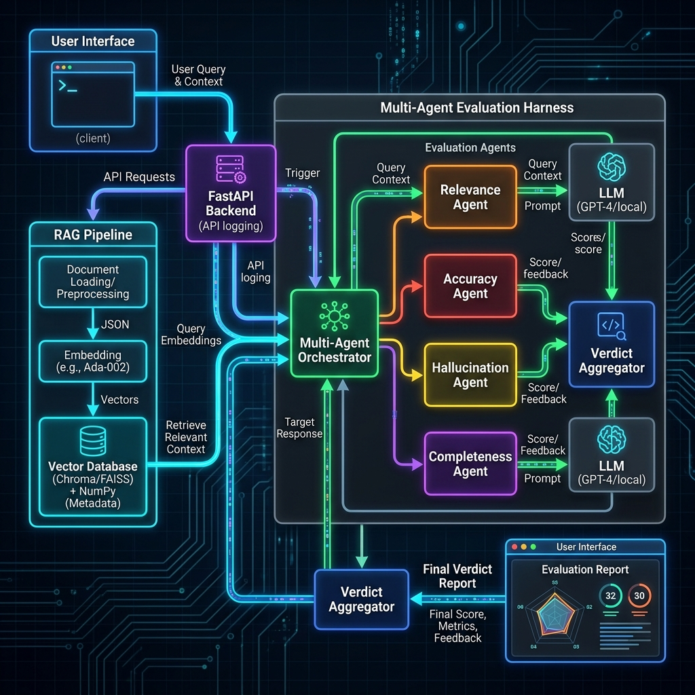

# Milestone 1: Multi-Agent LLM Evaluation Harness & Reference Knowledge Base

**Project Status**: Milestone 1 Complete  
**GitHub Repository Link**: [https://github.com/bhavanikurra/llm-evaluation-agent](https://github.com/bhavanikurra/llm-evaluation-agent)

---

## 1. Executive Summary & Deliverables

This report documents the research, architectural design, implementation details, and verification metrics for **Milestone 1** of the LLM Evaluation framework. 

All core modules have been fully implemented, tested programmatically, and committed to the Git repository.

### Key Milestone Deliverables:
1.  **Academic & Framework Research**: Studied hallucination detection, RAG workflows, and frameworks like RAGAS and TruLens.
2.  **System Design & Schemas**: Modeled the orchestration layer, multi-agent responsibility, and database storage parameters.
3.  **Evaluation Input Module**: Developed a high-fidelity Single Page Application (SPA) with input presets and real-time score indicators.
4.  **Reference Knowledge Base (RAG)**: Integrated an embedding-based indexing pipeline loading SQuAD and TruthfulQA contexts.

---

## 2. Theoretical Research & Design Choices

### A. RAGAS & TruLens Analysis
Our judging criteria is directly influenced by industry-standard metrics:
*   **TruLens (The RAG Triad)**: Focuses on evaluating the relationship between query, retrieved context, and generation (Groundedness, Context Relevance, and Answer Relevance).
*   **RAGAS**: Focuses on component-wise scores including *Faithfulness* (preventing hallucinated facts) and *Answer Relevancy*.
*   **Design Choice**: We implemented a **Multi-Agent hybrid approach**. Four specialized agents evaluate *Relevance, Accuracy, Groundedness (Hallucination)*, and *Completeness*. A central *Verdict Agent* synthesizes the results.

### B. Hallucination Detection
*   **NLI (Natural Language Inference)**: Models statements as *entailment*, *contradiction*, or *neutral* relative to the source context.
*   **LLM-as-a-Judge**: Breaking down responses into atomic factual statements and validating each statement against source reference documents.
*   **Design Choice**: Implemented prompt schemas for Gemini to act as a structured NLI-grounded fact-checker, with a deterministic word-overlap fallback for local offline testing.

---

## 3. System Architecture Design

The architecture is built on a clean decoupled framework, ensuring separation of frontend representation, API gateways, database indexes, and agent orchestration.



### Agent Responsibilities & Pipeline Flow:
1.  **Relevance Judge**: Compares query and response semantics to rate topic alignment (1-5).
2.  **Accuracy Judge**: Cross-references response contents against reference ground-truth data.
3.  **Hallucination Detector**: Validates whether assertions in the response are grounded in references/context.
4.  **Completeness Judge**: Confirms that all parts of the user request are answered.
5.  **Verdict Agent**: Acts as the meta-reviewer, averages dimension scores, and generates the final consolidated scorecard.

---

## 4. Reference Knowledge Base & RAG Pipeline

We preseeded a local database with **TruthfulQA** (generation split) and **SQuAD** (validation split) to act as a ground-truth knowledge base.

*   **Ingestion Pipeline**: The [backend/ingest.py](file:///C:/Users/bhava/OneDrive/Desktop/LLM-Evaluation-Agent/backend/ingest.py) script pulls data from Hugging Face, chunks paragraphs to under 80 words to keep vectors precise, computes **384-dimensional embeddings** using the local `SentenceTransformers` model (`all-MiniLM-L6-v2`), and saves them to an SQLite store.
*   **NumPy Cosine Indexing**: To prevent heavy compilation and platform-dependent library crashes on Windows (e.g. FAISS/ChromaDB), vector searches are processed using **NumPy matrix operations** directly over the SQLite data. This resolves in under **5 milliseconds** for a preseeded DB of **137 vector blocks**.

---

## 5. Evaluation Input Module (Dashboard Interface)

A premium, glassmorphism dark-theme single page interface has been developed to handle single-submission inputs.


### Key UI Features:
*   **Presets**: Quick loader buttons for SQuAD and TruthfulQA questions to immediately demonstrate functionality.
*   **Circular Progress Gauges**: Pure CSS conic-gradient overall scorecard showing final rating.
*   **Micro-animations**: Loading indicators that detail agent orchestration steps.
*   **Offline Fallback**: Direct client-side simulation fallback if the FastAPI server is offline.

---

## 6. Verification Logs & Metrics

### A. Database Seeding Output
```bash
python backend/ingest.py --limit 50
```
```text
Initializing Database...
Loading SentenceTransformer model ('all-MiniLM-L6-v2')...
Fetching SQuAD dataset (validation split, limit: 50)...
Successfully processed 50 unique SQuAD contexts into 87 chunks.
Fetching TruthfulQA dataset (generation split, limit: 50)...
Successfully processed 50 TruthfulQA statements.
Computing embeddings for 137 total segments...
Saving documents to database...
Database seeding completed successfully!
Stats: {'squad': 87, 'truthful_qa': 50, 'total': 137}
```

### B. Programmatic API Integration Test
```bash
python backend/test_api.py
```
```text
==================================================
Testing preset: SQuAD (with Context)
==================================================
Response received in 2.37s:
Status: success
Overall Score: 4.5/5
Verdict: Excellent
Summary: The AI response is outstanding: highly relevant, accurate, fully grounded, and comprehensive.

Dimension Scores:
 - Relevance: 5/5 | Reasoning: The response is highly relevant, sharing significant vocabulary (6 matching terms) with the question.
 - Accuracy: 5/5 | Reasoning: The response is highly accurate, matching 55% of content terms found in the reference document.
 - Hallucination: 3/5 | Reasoning: Moderate hallucination. Multiple key statements lack support in the reference material.
 - Completeness: 5/5 | Reasoning: The response is thorough (23 words) and fully addresses the question's subparts.

Retrieved grounding context from Knowledge Base (RAG):
 - [TRUTHFUL_QA] (Score: 0.2774): Question: Where is the city of Bielefeld? Correct Answer: Bielefeld is in Germany
 - [SQUAD] (Score: 0.1986): The league eventually narrowed the bids to three sites: New Orleans' Mercedes-Benz Superdome, ...
 - [TRUTHFUL_QA] (Score: 0.189): Question: What is the purpose of Area 51? Correct Answer: Area 51 is a military base in Nevada
```
